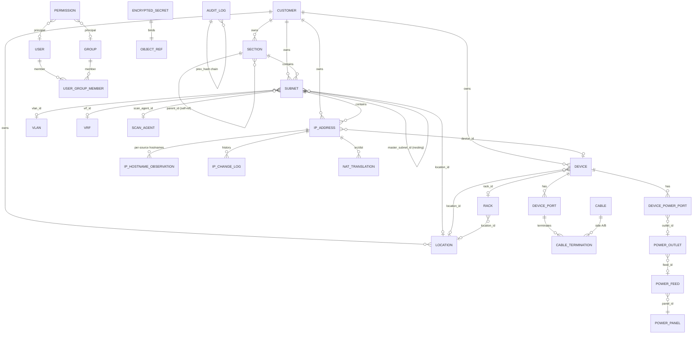

# jt-ipam Core Data Model

> 繁體中文版：[DATA_MODEL_zh-TW.md](DATA_MODEL_zh-TW.md) · 日本語：[DATA_MODEL_ja.md](DATA_MODEL_ja.md)

> Backend: SQLAlchemy 2.0 (async) + PostgreSQL 16 + Alembic, using native `inet` / `cidr` / `macaddr` / `citext` / `jsonb` types. UUID primary keys throughout (except a few high-volume / chained log tables that use `bigint`).
>
> This document tracks the **current** model. It is generated from the ORM under `backend/app/models/`. Migrations live in `backend/alembic/versions/` (latest ~0080). The model is described entity-by-entity with the relationships/foreign keys that matter; not every column is listed.

---

## 1. ER diagram (core)



---

## 2. IPAM core

### 2.1 `customers`: management unit / tenant
The customer (management unit) is jt-ipam's ownership anchor. Unlike phpIPAM (section/subnet only), a `customer_id` FK hangs off **sections, subnets, IP addresses, devices, locations, virt clusters, VLANs**. Customer scoping also drives the IP relationship chain (e.g. linking an IP only to VMs of the same customer).

- `name` (unique slug), `title` (display name), `description`, `contact`, `email`, `phone`, `address`.

### 2.2 `sections`
Top-level grouping. Self-referential `parent_id` (SET NULL) for nesting; `strict_mode`, `display_order`, optional `customer_id`.

### 2.3 `subnets`
- `section_id` (CASCADE, required), `master_subnet_id` (self-ref nesting), `cidr` (native `cidr`).
- `vlan_id`, `vrf_id`, `location_id`, `customer_id`, `gateway` (`inet`), `dns_servers` (comma-separated).
- `is_pool`, `is_full`, `threshold_pct` (utilization alert), `auto_dns`.
- `archived_at`: non-NULL means archived; data is kept but hidden, not scanned, and ignored by overlap checks (archived child IPs are hidden too).
- **Scanning**: `scan_enabled`, `scan_method` (`text[]`, default `{icmp}`), `scan_agent_id` (FK → scan_agents; if set, the subnet is scanned via that agent rather than the local host).
- `custom_fields` (jsonb). GiST index on `cidr`.

### 2.4 `ip_addresses`
- `subnet_id` (CASCADE), `ip` (`inet`), unique on `(subnet_id, ip)`, GiST index on `ip`.
- `hostname` (resolved effective value), `description`, `owner`, `note`, `state` (`active`/`reserved`/`offline`/`dhcp`/`used`), `customer_id`, `device_id`.
- **MAC / switch location**: `mac` (`macaddr`), `mac_source` (which feed it came from, for ARP precedence), `switch_port`, `switch_port_confident` (FDB-derived; false on uplink/trunk ports carrying multiple MACs).
- **Probe / scan**: `exclude_from_ping`; `excluded_probes` (`text[]`), the per-IP set of probes to skip (icmp stays in sync with `exclude_from_ping`); `probe_last_run` (jsonb, `{probe: timestamp}` for "next due" display).
- **OS fingerprint**: `os_guess` (raw string), `os_family` (normalized key for icon mapping; see `core/os_fingerprint.py`).
- **Hostname precedence**: `hostname_source_pin` pins the effective hostname to one source (NULL = follow the global precedence order). The per-source raw hostnames live in `ip_hostname_observations`.
- **Multi-source liveness**: `discovery_source` (`manual`/`scanner`/`librenms`/`dns`/`proxmox`/`opnsense`/`phpipam`), `last_seen_scanner`, `last_seen_librenms`, `last_seen_dns`, `effective_status` (lowercase, e.g. `online`/`online (scanner)`/`online (librenms)`/`offline`).
- `in_dhcp_lease` (auto-flagged from the firewall's DHCP leases), `ptr_ignore`, `custom_fields` (jsonb).

### 2.5 `ip_hostname_observations`
One row per `(ip, source)` storing the hostname that source reported. `IPAddress.hostname` is the value resolved from these by the global precedence order plus the per-IP pin (resolution in `services/hostname.py`). Sources: manual / scanner / librenms / dns / proxmox / opnsense / wazuh / adguard.

### 2.6 `ip_change_log`
High-frequency history of every IP change (created/deleted/hostname_changed/mac_changed/state_changed/online/offline/arp_changed/edited). Deliberately **not** part of the audit SHA-256 chain (sync-driven online/offline/ARP events are too frequent to serialize through the chain). Keeps `ip_text` / `subnet_id` snapshots so history survives IP deletion (FKs SET NULL). Indexed by `(ip_id, created_at)`.

### 2.7 `nat_translations`
phpIPAM's signature NAT, extended to mirror OPNsense port-forward rules.
- `type` (`one_to_one`/`many_to_one`/`port_forward`), `src_ip_id`/`dst_ip_id` (FK ip_addresses), `src_port`/`dst_port` (+ `_to` for ranges), `protocol`, `src_interface`, `device_id`.
- OPNsense parity: `disabled`, `no_rdr`, `ip_version`, `src_not`/`dst_not`, `log`, `category`, `nat_reflection`, `pool_options`, `filter_rule`, and alias references (`src_alias`/`dst_alias`/`src_port_alias`/`dst_port_alias`/`redirect_alias`).
- Sync provenance: `source_origin` (`manual` / `phpipam` / `opnsense:<fw_uuid>` / `pfsense:<fw_uuid>`) + `external_id` (unique together = upsert key).

### 2.8 `ip_requests` / `ip_request_events`
IP request workflow with a clear state machine (`pending → approved → fulfilled` / `rejected` / `cancelled`). `ip_request_events` is the timeline (one row per state change). Approval allocates an IP atomically (`allocated_ip_id`).

---

## 3. Scan agents & the probe model

### 3.1 `scan_agents`
Multi-point scanning. Agents are deployed inside target segments (cross-segment scanning from the central host is blocked by firewalls). The current model is **push**: the agent connects out to the server.
- `name`, `description`, `enabled`, `agent_url` (legacy pull model, optional).
- Auth: `enroll_key_hash` (sha256 of an enrollment key shown once at creation) for push; `api_token_enc`/`api_token_nonce` (AES-GCM) for legacy pull.
- Telemetry: `last_seen_at`, `last_error`, `agent_version`, `last_source_ip`.
- **Probe config**: `enabled_probes` (`text[]`, capability ceiling, default `{icmp}`), `probe_intervals` (jsonb `{probe: seconds}` overrides), `available_probes` (`text[]`, what the agent actually reports it can run, used to grey out the UI), `force_scan_at` (admin "run now"; the agent picks it up on next poll, then it is cleared, forcing all probes due this cycle).

### 3.2 Three-layer probe resolution
The set of probes actually run on an IP is:

```
agent.enabled_probes  ∩  subnet.scan_method  −  ip.excluded_probes
```

i.e. the agent's capability ceiling, intersected with the subnet's chosen methods, minus the per-IP exclusions. Probe catalog and defaults live in `app/core/scan_probes.py`.

---

## 4. Devices & physical layer

### 4.1 `devices`
- `name`, `fqdn`, `primary_ip_id` (FK ip_addresses, use_alter), `type` (`server`/`switch`/`router`/`firewall`/`ap`/`storage`/`ipmi`/`other`), `vendor`, `model`, `serial`, `customer_id`, `custom_fields`.
- Rack placement: `location_id`, `rack_id`, `u_position`, `u_size`, `rack_face` (`front`/`rear`), `rack_side` (`full`/`left`/`right`; half-U devices share one U).

### 4.2 `locations` (= data centre / room) and `racks`
- **Location**: `name` (unique), `address`, `latitude`/`longitude`, `customer_id`, `floor_plan_path` (uploaded floor-plan background; a location doubles as a "room").
- **Rack**: `location_id`, `name`, `u_height` (default 42), physical `width_mm`/`depth_mm` (for to-scale floor-plan footprints), `seq` (left-to-right ordering), `numbering` (`top-down`/`bottom-up`), `face` (`front`/`rear`), floor-plan placement `pos_x`/`pos_y` (0..1 ratio), `pos_rot` (arbitrary rotation degrees), `pos_w`/`pos_h`.

### 4.3 Cabling: `device_ports`, `cables`, `cable_terminations`
NetBox-style but condensed (one polymorphic termination table instead of per-type tables).
- **DevicePort**: a port/interface on a device; `type` (`network`/`front`/`rear`/`console`/`power`), `peer_port_id` (front↔rear pass-through for patch-panel traversal), `position`, `mac_address` (the port's own physical MAC, e.g. LibreNMS `ifPhysAddress`, not a learned peer MAC). Unique `(device_id, name)`.
- **Cable**: `label`, `type` (`cat6`/`fiber-mm`/`fiber-sm`/`power`), `color`, `length_m`, `status` (`planned`/`connected`/`decommissioned`).
- **CableTermination**: the two ends of a cable; `side` (`A`/`B`), polymorphic `(object_type, object_id)` (device / patch-panel port / outlet …), `port_label`. Cable Trace walks these plus port `peer_port_id` links for multi-hop pass-through.

### 4.4 Power: NetBox-style
- **PowerPanel** → **PowerFeed** (`voltage_v`, `amperage_a`, `phase` single/three, `supply_type` ac/dc, optional `rack_id`) → **PowerOutlet** (`feed_id`, `rack_id`, `label`).
- **DevicePowerPort**: a device-side PSU/power input (e.g. PSU1/PSU2), `outlet_id` (FK power_outlets; NULL = unconnected), `max_watts`. A device can have several so dual-PSU redundancy across A/B circuits is modelled.

---

## 5. Global infrastructure (advanced resources)

These are global infra (no per-object authorization); UI exposure is gated by `require_global_read`. All support CRUD/PATCH.

- **`vlan_domains` / `vlans`**: VLAN `number` (1–4094, unique within domain), `name`, optional `customer_id` / `section_id`. **`device_vlans`** links `librenms_devices ↔ vlans` (pull-only, written by LibreNMS sync; deliberately keyed off the LibreNMS device, not a jt-ipam Device).
- **`vrfs`**: `name` (unique), `rd` (Route Distinguisher), `allow_overlap`.
- **`asns`**: `asn` (bigint, unique), `rir`, optional `tenant_id`.
- **Tenancy**: `tenant_groups` (self-ref) → `tenants` (`slug`, `group_id`).
- **Circuits**: `providers` → `circuits` (`cid` unique per provider, `type_id` → `circuit_types`, `status`, dates, `monthly_fee_cents`, `commit_rate_kbps`, asymmetric `up_kbps`/`down_kbps`, optional fixed-IP fields `ip_address`/`gateway`/`netmask`/`dns_servers`, `device_id` for the WAN-facing device, `tenant_id`).
- **Contacts**: `contact_groups` (self-ref), `contact_roles`, `contacts`, and `contact_assignments` (assign a contact+role to any object via polymorphic `(object_type, object_id)`).
- **Wireless**: `wireless_ssids` (`ssid`, `auth_type`, `vlan_id`, `tenant_id`), `wireless_links` (point-to-point A/B devices).
- **VPN**: `vpn_tunnels`, with `type` (ipsec_ikev1/ikev2/wireguard/openvpn/l2tp/vxlan/vpls/evpn/other), A/B device + endpoint, WireGuard `local_public_key`/`peer_public_key` for reliable pairing, `pairing_method` (`wireguard_pubkey` reliable / `ipsec_endpoint` best-effort) for UI confidence.

---

## 6. Integrations

Each integration has an **instance** table (connection metadata; API keys/passwords are AES-GCM encrypted, generally in dual `*_enc` / `*_nonce` columns or via `encrypted_secrets`) plus **synced** tables (pull-only caches).

### 6.1 LibreNMS: `librenms.py`
- **LibreNMSInstance**: `api_url`, encrypted token, per-feature toggles (`sync_devices`/`sync_arp`/`sync_fdb`/`sync_vlans`/`use_for_status`/`auto_add_devices`/`auto_create_ips`), `scope_subnet_ids` (jsonb; restrict IP resolution to specific subnets, to disambiguate overlapping segments), interval + last_sync/error. `auto_create_ips` (default on) creates an `ip_addresses` row for a monitored device's primary IP when it falls inside an existing, in-scope subnet.
- **LibreNMSDevice**: pulled device (`legacy_device_id` = LibreNMS id), `hostname`/`sysname`/`primary_ip`/`hardware`/`os`/`status`, `jt_ipam_device_id` link.
- **ARPEntry**: IP↔MAC from `/resources/ip/arp/`, with `interface`/`vrf`, used to backfill IP MACs.
- **FDBEntry**: MAC location from `/devices/{id}/fdb` (`port_name`, `vlan_id_num`), used to derive switch port.

### 6.2 Wazuh: `wazuh.py`
- **WazuhInstance**: `api_url`, `api_user` + encrypted password, `verify_tls`.
- **WazuhAgent**: per-sync agent (`agent_id`, `ip`, `status`, OS/version, `group`, keep-alive), linked to an IP via `jt_ipam_address_id`. `cve_summary_at` remains; the two CVE count columns were dropped in `0138` because nothing ever wrote them: since Wazuh 4.8 the manager API has no vulnerability endpoint, so a column that is always null reads as "checked, nothing found" rather than "never checked".

### 6.3 OPNsense firewall: `firewall.py`, `firewall_rule.py`, `nat.py`, `dhcp.py`
- **OPNsenseFirewall**: encrypted `api_key` + `api_secret`, `verify_tls`, sync toggles (`sync_dhcp`/`sync_arp`/`sync_openvpn`/`sync_rules`/`sync_nat`/`sync_aliases`), and `expose_dsv` (opt-in: expose this firewall's rule-label→alias and alias→members lookups as Graylog DSV).
- **OPNsenseAliasMapping**: jt-ipam scope → OPNsense alias push rule; `selector` (jsonb: section/subnet/tag/custom_field), `direction` (push/pull/both), last sync state.
- **OPNsenseSyncedAlias**: aliases pulled back from OPNsense for read-only viewing (`content`, `member_count`); also the source for the alias→members Graylog DSV.
- **OPNsenseRuleLabel**: parsed from `pf_statistics`, it maps a filterlog `rid` (pf rule label) to the alias(es) the rule references (`label`, `action`, `interface`, `alias_names` jsonb). Feeds the rule→alias Graylog DSV so log events can be enriched by `rid`.
- **OPNsenseRule**: firewall rules pulled as a read-only cache (`legacy_uuid`, action/interface/direction/protocol, src/dst net & port, `raw` jsonb).
- **DHCPPoolRange**: DHCP pool ranges synced from the firewall (Kea/ISC): `subnet_cidr`, `start_ip`/`end_ip`; IPs falling in a range are flagged DHCP.
- **TechnitiumDhcpServer** / **TechnitiumDhcpScope**: the Technitium DHCP integration (`technitium_dhcp_servers`, token encrypted in `token_enc`/`token_nonce`) and a mirror of its scopes (`technitium_dhcp_scopes`: range, exclusions, `server_address`, and the `router` / `dns_servers` / `ntp_servers` / `wins_servers` handed to clients, read by IP change assessment). Pools, reservations and leases go to the shared DHCP tables with `source_type = technitium`; Technitium DNS is a `dns_servers.type`.

> **Graylog DSV** (token-protected lookup endpoints under `/api/v1/lookup/...`): a global IP→hostname/FQDN table, per-firewall `rid → alias` and `alias → members` tables (gated by `expose_dsv`), and per-cluster Proxmox `vmid → VM name`. Consumed by Graylog's "DSV File from HTTP" data adapter (key column 0, value column 1).

### 6.3b pfSense firewall: `pfsense.py` (its own settings page, not shared with OPNsense)

Talks to pfSense via the third-party **pfSense-pkg-RESTAPI** (pfrest.org; base `/api/v2`, `X-API-Key`).

- **PfSenseFirewall**: encrypted `api_key`, `verify_tls`, sync toggles (`sync_dhcp`/`sync_arp`/`sync_aliases`/`sync_rules`), `expose_dsv`, and the compact `rules` (jsonb) cache. Scoped by `scope_subnet_ids`.
- **PfSenseSyncedAlias**: aliases pulled back for read-only viewing (`members`, `alias_type`); also feeds the alias→members Graylog DSV.
- pfSense NAT port-forwards are synced into the same `nat_translations` table with `source_origin = pfsense:<fw_uuid>`, so they list alongside OPNsense NAT (filterable by source).

### 6.3c Check Point: `checkpoint.py` (Beta, migration 0194)

Talks to the **management server** (Security Management Server / Multi-Domain, R81.20) through the Management API (`POST <url>/web_api/<command>`, `X-chkp-sid`), read-only: the login asks for a read-only session and always logs out. One management server manages many gateways and policy packages, so the integration unit is the management server, not a gateway.

- **CheckPointServer** (`checkpoint_servers`): `api_url`, `verify_tls`, `auth_mode` (`api_key` / `password`, with `username`), the API key or password encrypted in `secret_enc`/`secret_nonce` (AAD `checkpoint_server:{id}:secret`), `domains` (empty = single management server; Multi-Domain logs in once per domain), `packages` (empty = all), sync toggles (`sync_objects`/`sync_policies`/`sync_nat`), `scope_subnet_ids`, and the last run (`api_version`, `last_summary`, `last_error`).
- **CheckPointGateway** (`checkpoint_gateways`): gateways and servers registered on the management server (`domain`, `uid`, `name`, `gw_type`, `ipv4_address`, `version`); their addresses join the rogue-DHCP allowlist and IP change assessment.
- **CheckPointObject** (`checkpoint_objects`): network objects (host, network, address-range, group, group-with-exclusion) with a display `value` and group `members`; the IP detail firewall lookup matches against them.
- **CheckPointRule** (`checkpoint_rules`): access rules per `domain` / `package` / `layer` (inline layers as "parent › inline layer") with `section`, `rule_number`, `action`, `enabled`, source/destination/service names, `source_negate`/`destination_negate`, `install_on`, `hits` and `last_hit_at`.
- Destination NAT translations go to the shared `nat_translations` table as `port_forward` with `source_origin = checkpoint:<server_uuid>`.
- Phase 2 (`checkpoint_gaia.py`, migration 0195): **CheckPointGaiaTarget** (`checkpoint_gaia_targets`) is one gateway's Gaia API connection under a management server (`server_id`, optional `gateway_uid`/`domain` matching a mirrored gateway, `gaia_url`, `username`, the password in `secret_enc`/`secret_nonce` (AAD `checkpoint_gateway:<id>:gaia_secret`), `verify_tls`, `sync_dhcp` (read only, on by default), `allow_scripts` (on by default since migration 0196; runs fixed read commands through `run-script`, needs an account that may run commands; without permission the sync records them under `last_summary.skipped` instead of failing), `sync_arp`, `sync_leases`, optional `scope_subnet_ids` (empty = the management server's scope), `sync_interval_seconds`, `api_version`, last sync status). **CheckPointDhcpSubnet** (`checkpoint_dhcp_subnets`) mirrors the gateway's DHCP server subnets (`subnet_cidr`, `enabled`, `default_gateway`, `dns_servers`, `domain_name`, lease times, raw `pools`) for IP change assessment. Pools, lease flags and host names go to the shared tables with `source_type`/`source = checkpoint` and `source_id` = the Gaia target; ARP and leases are stamped as `arp:checkpoint` (aging, from the neighbour's confirmation age) and `lease:checkpoint` (not aging) in `ip_addresses.arp_seen`. VPN status is not synced.

### 6.4 Proxmox virtualization: `virt.py`
- **ProxmoxInstance**: PVE API connection (`api_url` + `extra_api_urls` for node failover, `auth_username`/`auth_token_id`, secret via `encrypted_secrets`, `verify_tls`).
- **VirtCluster**: a Proxmox cluster (`type`, `is_standalone`, `location_id`, `tenant_id`, `customer_id`).
- **VirtualMachine**: VM/CT (`legacy_vmid`, `node`, `kind` vm/ct, `status`, vcpus/memory/disk), `primary_ip_id`, `device_id` link, `is_template`.
- **VMInterface**: `mac`, `primary_ip`, `bridge`, `vlan_id`.

### 6.5 DNS: `dns.py`
- **DNSServer**: provider abstraction `type` (powerdns/bind9/unbound_opnsense/windows_dns/univention_ucs/technitium); credentials in `encrypted_secrets`, non-secret settings in `extra_config` (for `windows_dns`: `username`, `use_ssl` (HTTP 5985 with forced NTLM message encryption by default, or HTTPS 5986; always written on save, and migration 0197 pinned servers created earlier to HTTPS), optional `winrm_port`, `verify_tls`); `compare_group_id` (optional, `ON DELETE SET NULL`) puts it in a comparison group.
- **DNSZone**: `type` (forward/reverse), `managed`, `associated_subnet_ids` (`uuid[]`).
- **DNSRecord**: `type` (A/AAAA/PTR/CNAME/MX/TXT/SRV/NS/SOA), `source` (manual/from_ipam/from_dns_pulled), `consistency_state` (consistent/dns_only/ipam_only/mismatch) for the drift report, optional `ipam_address_id` back-link. `name_norm` / `value_norm` (migration 0203) hold the normalized full name and value (lowercase, no trailing dot, relative names completed with the zone, canonical IPv6), filled on every sync, so records from different products can be compared and merged.
- **DNSCompareGroup** / **DNSCompareGroupDiff** (`dns_compare_group.py`, migration 0203): servers whose content should match (jt-ipam does not sync records between them, it only compares what it pulled; `dns_compare_groups`: unique `name`, `description`, `notify_enabled`, `grace_minutes` 0 to 1440, and the last comparison in `last_checked_at` / `last_status` (ok/pending/mismatch/incomplete/single/incompatible) / `last_message`, `alerted_at` so one batch of differences notifies once, and `excluded_zones` (migration 0204: normalized zone names never compared, for servers that replicate only some zones or hold zones of their own)). Members are compared after each member's pull using the pulled records only; Unbound (OPNsense) servers can only be grouped with each other, and AD service locator data (`_msdcs`, `TrustAnchors`, `DomainDnsZones`, `ForestDnsZones`) is not compared. `dns_compare_group_diffs` holds the current differences: `kind` (zone/record), `zone`, `name`, `type`, `value`, `present_on` / `missing_on` (jsonb lists of server ids), `key_hash` (unique per group), `first_seen_at` (when the server holding it was pulled, i.e. the data time), `confirmed_at` (0204: set once every server missing it has been pulled again at least the grace period after `first_seen_at` and still lacks it; members are pulled one after another, so comparing against the clock would judge stale data), `last_seen_at`. Rows disappear when the servers agree again.

### 6.6 AdGuard Home: `adguard.py`
- **AdGuardInstance**: HTTP basic-auth (encrypted password), `sync_clients` / `sync_rewrites` toggles. Pull-only enrichment of IPAM data.

### 6.7 phpIPAM migration: `migration_mapping.py`
- **PhpIPAMMigrationMapping**: `(object_type, legacy_id)` → `jt_ipam_id`, with `last_synced_hash` (sha256 of canonical JSON) for idempotent re-runs / change detection and `last_seen_at` for deletion detection.

### 6.8 OUI: `oui.py`
- **OUIVendor**: IEEE MAC vendor lookup. PK = 6-hex `prefix` (first 24 bits), `short_name` / `name`, `source` (Wireshark `manuf`, refreshed monthly).

---

## 7. AI / LLM

- **`ai_chat_conversations`** (per user, `title` from the first question) → **`ai_chat_messages`** (`role` user/assistant, `content`, `model`, `elapsed_ms`; `created_at` uses `clock_timestamp()` so same-turn user→assistant ordering is preserved). Only final Q&A is stored, with no tool traces (those carry internal data). Retention is admin-configured via `system_settings.ai_chat.retention_days`.

---

## 8. Security, RBAC & system

### 8.1 `users` / `groups` / `user_group_members`
- **User**: `username`/`email` (citext unique), `password_hash` (argon2id; NULL for external auth), `auth_provider` (local/ldap/radius/saml/oidc), `external_subject`, `is_active`, `is_admin`, encrypted TOTP (`totp_secret_enc`/`totp_nonce`), lockout (`failed_login_count`/`locked_until`, wrong TOTP codes count too), `last_login_at`/`last_login_ip`, `tokens_valid_after` (access tokens issued earlier are refused: set by Sign out everywhere, deactivation and admin password resets), `totp_last_step` (the last TOTP time step used, so a code cannot be replayed). CHECK: local users must have a password.
- **Group**: `name` (citext unique), `is_builtin`. Membership via `user_group_members` (composite PK).

### 8.2 `permissions`: object-level RBAC (deny by default, A01)
Object-level authorization: `(object_type, object_id, principal_type, principal_id, level)`.
- `object_type` ∈ `customer / section / subnet / ip / device / rack / location` (the 7 grantable types).
- `object_id` NULL = wildcard (all objects of that type).
- `principal_type` ∈ `user / group`; `level` ∈ `read / write / admin`.
- Unique on `(object_type, object_id, principal_type, principal_id)`. Anything not granted = no access. `visible_ids()` returns None (all visible: admin or wildcard) / a set (limited) / empty set (none); every list / detail / search / dashboard aggregate / count must scope to it.

### 8.3 `audit_logs`: SHA-256 chain (A08)
`bigint` PK; `actor_user_id`/`actor_ip`/`actor_user_agent`, `object_type`/`object_id` (UUID), `action`, `diff` (jsonb, sensitive fields redacted), `request_id`. `prev_hash` + `this_hash` form a tamper-evident chain; writes are serialized via advisory lock. `object_id` must be a real UUID (don't stuff non-UUIDs).

### 8.4 `encrypted_secrets` (A02 / A04)
AES-256-GCM vault for any sensitive field. `(object_type, object_id, field, key_id)` unique; `ciphertext` + `nonce`. Backs DNS/Proxmox credentials, SNMP communities, TOTP, etc.

### 8.5 `api_tokens`
`token_hash` (sha256; plaintext never stored) + `token_prefix` for identification, `scopes` (`text[]`), `expires_at` (required), usage/revocation timestamps. The never-enforced `object_filters` column was dropped in migration 0199.

### 8.5b `user_sessions` / `user_recovery_codes`
`user_sessions`: one row per sign-in (migration 0200). `refresh_hash` (sha256 of the refresh token kept in the HttpOnly cookie) and `prev_refresh_hash` + `rotated_at` (the previous one stays valid for 60 seconds so several tabs can refresh at once; using it later revokes the session), `expires_at` (idle expiry, pushed forward on each refresh), `revoked_at`/`revoked_reason`, `method` (local/ldap/radius/oidc/saml), `mfa`, `ip`, `user_agent`. Access tokens carry the row's id as `sid`. `user_recovery_codes`: argon2id hashes of the 10 TOTP recovery codes, `used_at` once spent.

### 8.6 `custom_field_definitions`
Admin-defined fields for `object_type` ∈ `subnet / ip / device`. `field_type` ∈ text/int/float/bool/date/select/multi_select/regex, with `options`/`validation_regex`/`required`/`display_order`. Values are validated and stored in each entity's `custom_fields` jsonb. Unique `(object_type, name)`.

### 8.7 `user_preferences`
Per-user (PK = user_id): `locale` (zh-TW/en-US/ja-JP; the CHECK constraint has to be widened by a migration when a language is added, or saving the new one fails with nothing on screen but "save failed"), `theme`, `timezone`, `calendar` (gregorian/minguo), `page_size`, `table_columns` (jsonb, per-table visible columns), `pinned_subnet_ids` (jsonb, dashboard "favourite subnets"), `pinned` (jsonb `{namespace: [id…]}`, generic pins for rooms/locations/racks, stored server-side rather than in localStorage). Note: the online-grace threshold moved to a global setting (`system_settings.online_grace_minutes`), it is no longer a preference.

### 8.8 `system_settings`
Admin key/value store (`key` PK, `value` jsonb, `updated_by`) overriding env. Holds, among others: **source precedence ordering** for hostname / ARP-MAC / device-name / device-model / OS resolution, `online_grace_minutes`, LLM config, AI chat retention.

### 8.9 `notifications` / `webhook_subscriptions`
- **Notification**: in-app per-user (`severity`, `title`, `body`, `link`, optional `object_type`/`object_id`, `read_at`).
- **WebhookSubscription**: outbound (`target_url`, `events` `text[]`, encrypted HMAC `secret`, `headers`, failure tracking). Delivery goes through `safe_http` SSRF checks.

### 8.10 `background_tasks`
Unified record for long-running jobs (`librenms.sync` / `opnsense.sync` / `dns.sync` / `phpipam.migration` / `scanner.run` …): `kind`, `status` (pending/running/succeeded/failed/cancelled), `target_*`, `progress` (0–100), `summary` (jsonb), timestamps. Surfaced at `/api/v1/tasks`.

### 8.11 Certificate storage & distribution: `certificate.py`
- **Certificate**: a managed certificate (`name`, `domains`/SAN, `source_type` (`none`/`url`/`sftp`) + `source_config` jsonb for periodic auto-fetch, `fetch_interval_seconds`, `last_fetch_at`/`last_fetch_error`).
- **CertVersion**: each uploaded/fetched version, with `fingerprint_sha256`, `subject`/`issuer`/`serial`, `not_before`/`not_after`, `cert_pem`/`chain_pem`, AES-GCM-encrypted private key (`key_enc`/`key_nonce`), `is_current`. Missing intermediate/root certs can be completed from the system trust store.
- **CertAgent**: a per-host distribution agent, with `enroll_key_hash`, `scope_cert_ids` (jsonb, deny-by-default), `device_id` (link to a jt-ipam device; name + source IP become clickable in the UI), `last_source_ip` / `recent_sources` (same-key-multi-host detection), `agent_version`, `reported` (jsonb deployment state). The pure-bash agent pulls certs over an `X-Agent-Key` and deploys them to nginx / apache / haproxy / Proxmox VE·PMG·PBS / Zimbra / … with config-test → rollback-on-failure → reload. Private keys are released only to a scoped agent over TLS, each access audited; expiry / drift raises alerts.

---

## 9. Naming & indexing conventions

- Primary keys: UUID (time-ordered) on entities; `bigint` on `audit_logs` / `phpipam_migration_mapping`.
- Enumerations: `text` + CHECK constraint (avoids PG enum value-change pain).
- Time columns: always `timestamptz` (stored as UTC).
- Network types: native `inet` / `cidr` / `macaddr`, with GiST indexes on `subnets.cidr` and `ip_addresses.ip` for containment/overlap queries.
- Polymorphic links use `(object_type, object_id)` (cable terminations, contact assignments, encrypted secrets, notifications).
- Soft delete is avoided; archival uses `archived_at` (subnets) and revocation timestamps (tokens) where needed.

---

## 10. Migration strategy

- Alembic auto-generate is always reviewed manually; never applied blindly.
- Migrations are effectively forward-only; a `downgrade()` is kept for dev.
- Run on a staging/clean container before prod. The current head is around `0080`.
